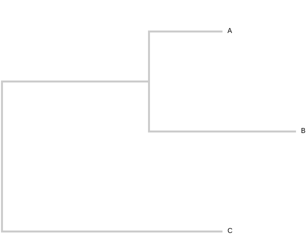

###Data, Javascript and visuals
***
####Ivan Kryukov
#####_December 8, 2014_
#####Slides with [reveal.js](http://lab.hakim.se/reveal-js/)

---
###Bioinformatics is hard
- Too much data
- Too little time
___
###Data analysis does not have to be hard
- We are not the only ones with having data issues
- We should come together as a community
- We should focus more on our tools being accessible

___
###Multiple sequence alignment formats

EMBL, GenBank, Fasta(Pearson), Clustal/ALN, ACEDB, BLAST, DNAStrider, FlatFeat/FFF, GCG, GFF, IG/Stanford, MSF, NBRF, PAUP/NEXUS, Phylip(Phylip4), Phylip3.2
___


###Phylogeny formats

Newick, NEXUS, clustal, phyloxml, nexml, cdao

---

###JSON format

```javascript
{
  "firstName": "John",
  "lastName": "Smith",
  "age": 25,
  "address": {
    "streetAddress": "21 2nd Street",
    "city": "New York",
    "state": "NY",
    "postalCode": "10021-3100"
  },
  "phoneNumbers": [
    {
      "type": "home",
      "number": "212 555-1234"
    }
  ]
}
```
___
###Phylogenies in JSON

```javascript
{"name":"root","length":0,"children":
    [{"name":"C","length":0.3},
    {"name":"internal","length":0.2,"children":
        [{"name":"A","length":0.1},
		{"name":"B","length":0.2}]}]}
```


___
###Why JSON
- Name
- `C` - [Jansson](http://www.digip.org/jansson/)
- `perl` - [JSON](http://search.cpan.org/~makamaka/JSON-2.90/lib/JSON.pm)
- `python` - [Standard](https://docs.python.org/2/library/json.html)
- `javascript`
```javascript
JSON.parse('in.json');
```

---
###SVG

**S**calable **V**ector **G**rapics

- Adobe Illustrator
- Inkscape

___

###Front-end Web

- HTML
- CSS
- SVG
- javascript

___

###D3

####[Data Driven Documents](http://d3js.org)

___

###C3
####[Comfortable Customizable Controllable](http://c3js.org/)

---
#Showcase
___
##[Polar clock](http://bl.ocks.org/mbostock/1096355)
___
##[Chord diagrams](http://bl.ocks.org/mbostock/1046712)
___
##[Quicksort](http://bl.ocks.org/mbostock/d8e15a0ab7f85818a5bd)
___
##[Baseball](http://www.nytimes.com/interactive/2013/03/29/sports/baseball/Strikeouts-Are-Still-Soaring.html?ref=baseball)
___
##[Flow](http://bost.ocks.org/mike/sankey/)
___
##[Realtime data](http://square.github.io/cubism/)

---
#Applications
___
##[Kablammo!](http://kablammo.wasmuthlab.org/)

___

##[Palantir](file://Palantir/visualization/index.html)

---

#Tutorial
